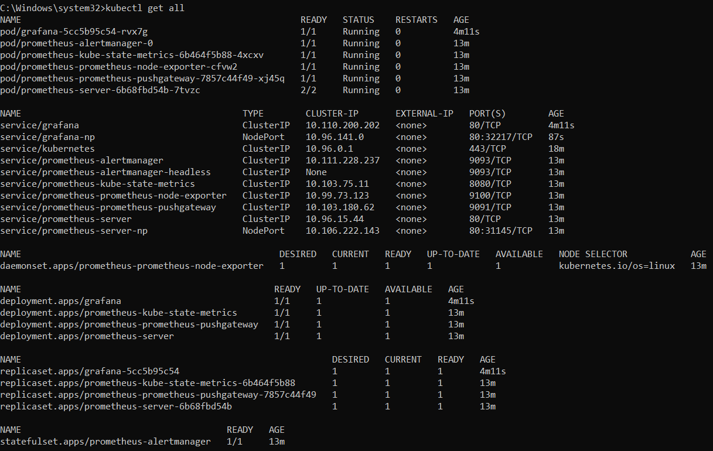

# Лабораторная работа №4

## Цель работы

Сделать мониторинг сервиса с помощью prometheus и grafana

## Ход работы

Установка Prometheus:

    

Запуск сервисов Prometheus:

    

Установка Grafana:

    

Запуск сервисов Grafana:

    

С помощью команды `kubectl get all` была проверена работоспособность сервисов.

    

Запуск Prometheus:

    

После запуска открылась страница в браузере:

    

Запуск Grafana:

    

Для того, чтобы войти в сервис Grafana нужно ввести логин, в нашем случае: `admin` и пароль, который был расшифрован и записан в файлик с помощью следующих команд:

    

После введения логина и пароля открылась страница Grafana в браузере:

    

После было настроено получение Grafana метрик с Prometheus. Для этого в разделе «connection - data source». Было добавлено соединение с Prometheus.

    

После был создан новый Dashboard в качестве типа отображения был импортирован node-exporter-full (по id) на странице, которую рекомендует Grafana (https://grafana.com/grafana/dashboards/)

Результат:

    

## Вывод

Был успешно настроен мониторинг сервиса, запущенного в Kubernetes, с использованием Prometheus и Grafana. Было настроено отображение графиков для отслеживания 
нагрузки
